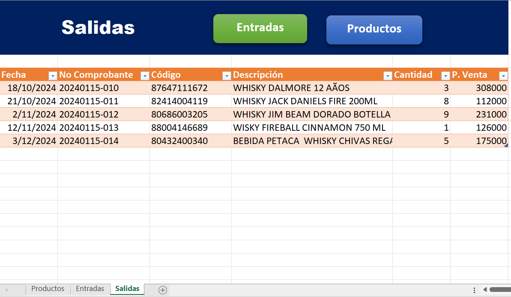

# Larissa Cabrera - Data Analyst Junior Portfolio
## About me
Hi, I'm Larissa Cabrera! 👋

I am an Industrial Engineering student with a solid and continuous background in Data Analysis. I am actively seeking an opportunity to apply my knowledge in a dynamic environment as a Junior Data Analyst, where I can contribute to efficient information management. My focus is on data interpretation, generating strategic insights, and the continuous improvement of data quality.

During my academic and practical experiences, including roles as a BI Analyst and Intern, I have honed my skills in collecting, cleaning, and analyzing large datasets. I am proficient in creating interactive Power BI dashboards to monitor KPIs and have experience performing detailed analyses on sales, inventory, and consumer trends to derive actionable insights.

I am passionate about transforming raw data into meaningful stories that drive strategic decisions. I am always eager to learn new tools and techniques to further my expertise in the data field.

This repository serves to showcase my skills, share my projects, and track my progress in Data Analytics and Data Science.

📫 How to reach me: laricabrera951@email.com | [LinkedIn](https://linkedin.com/in/LarissaCabrera)
## Portfolio Projects
### Python
#### Fashion Sales Analysis ([Fashion_sales.ipynb](https://github.com/LadyC98/TUTORIALPY/blob/main/Fashion_sales.ipynb))
I focused on analyzing a sales transaction dataset to derive actionable business insights and assess performance improvements. The dataset included key metrics such as 'Customer Reference ID', 'Item Purchased', 'Purchase Amount (USD)', 'Date Purchase', 'Review Rating', and 'Payment Method'. The analysis involved comprehensive data cleaning, exploratory data analysis (EDA), deep dives into customer segmentation and satisfaction levels, and a root cause analysis to understand business performance drivers.

- **Skills:** data loading, data cleaning, data preprocessing, exploratory data analysis (EDA), customer segmentation, root cause analysis, business intelligence, data visualization.

- **Technology:** Python, Pandas, NumPy, Seaborn, Matplotlib, Plotly.

- **Results:** The final analysis yielded significant business insights, including a massive 206% profit growth comparing performance across 2022 and 2023. The results indicated a sustainable business model, as the simultaneous improvement in profit and review ratings suggests improving customer satisfaction.
#### Inventory Optimization and Sustainability Analysis ([Inventory_Analysis.ipynb](https://github.com/LadyC98/TUTORIALPY/blob/main/Inventory_Analysis.ipynb))
The analysis involved data preprocessing, deep-dive inventory analysis, product sales performance evaluation, purchasing analysis, and the calculation of optimal stock levels. The main goal was to derive data-driven purchasing strategies to cut costs and prevent overstocking and waste.
- **Skills:** Data Preprocessing, data cleaning, Inventory Analysis, Sales Analysis, Purchasing Analysis, Optimal Stock Level Calculation, data visualization.

- **Technology:** Python, Pandas, NumPy, Matplotlib, Seaborn.
- **Results:** The analysis provided clear recommendations for managing inventory more efficiently.
1.  **Best-Selling Products:** The project successfully identified the best-selling products, such as "Smirnoff 80 Proof".
2.  **Inventory Gaps:** For all top 10 products (by order quantity), the analysis revealed that the current stock was below the recommended stock levels, clearly indicating a need for immediate restocking.
3.  **Sustainability Insight:** It was noted that consistent zero inventory counts for certain products at both year start and end indicate potential issues with inventory management or procurement, warranting a review of demand for a more sustainable approach.
4.  **Top Performer Consistency:** High consistency among the top-stocked products suggested steady demand and effective existing replenishment strategies for popular items.
#### Retail Customer Segmentation with RFM ([Proyecto_CustumerSegmentation.ipyng](https://github.com/LadyC98/TUTORIALPY/blob/main/Proyecto_CustumerSegmentation.ipynb))
 The primary objective was to leverage these classifications to help the business gain valuable customer insights and run more effective, targeted marketing campaigns. The analysis utilized the RFM (Recency, Frequency, and Monetary) model combined with a quantile scoring method. The process involved extensive data cleaning (handling missing values and duplicates), data manipulation to create the RFM variables, and finally, customer segmentation.

- **Skills:** RFM Analysis, customer segmentation, data cleaning, data manipulation, quantitative analysis, quantile scoring, descriptive statistics, data visualization.

- **Technology:** Python, Pandas, NumPy, Matplotlib, Seaborn.

- **Results:** The comprehensive analysis of the transaction data yielded several key findings that support the marketing objectives:

1. **Data Cleaning:** The initial dataset (541,909 rows) was thoroughly cleaned by removing approximately 25% of records due to missing customer IDs and dropping over 5,200 duplicate entries.

2. **Customer Spending:** The analysis determined the average customer spend per transaction is approximately $480.

3. **RFM Metrics:** Descriptive statistics highlighted that the average customer made a purchase 91 days ago (Recency) and has shopped 4.27 times (Frequency), with an average total spend of $2,048.69 (Monetary).

4. **Segmentation:** The RFM scoring successfully identified various customer segments. For example, the '555' RFM group (Champions) showed the highest mean total spending at $2,368.93, indicating them as the most valuable customers for high-impact campaigns.
#### Retail Fashion Sales Analysis Return Prediction ([Retail_Fashio_Return_Prediction.ipynb](https://github.com/LadyC98/TUTORIALPY/blob/main/Retail_Fashion_Return_Prediction.ipynb))
This project uses a Logistic Regression model to predict product returns for a fashion boutique. The process involved comprehensive data cleaning, exploratory data analysis (EDA), and feature analysis on sales data to build an accurate return forecasting system.
- **Skills:** Data cleaning and preprocessing, Exploratory Data Analysis (EDA), Correlation analysis, Predictive Modeling, Logistic Regression, Feature Engineering (One-Hot Encoding), Model Evaluation (Accuracy, Confusion Matrix, ROC/AUC), Permutation Importance.

- **Technology:** Python, Pandas, NumPy, Scikit-learn, Matplotlib, Seaborn.

- **Results:** The predictive model was highly effective in forecasting returns:

1. **Prediction Accuracy:** The Logistic Regression model achieved a high prediction accuracy of approximately 87.44% on the test set.

2. **Model Performance:** The Area Under the ROC Curve (AUC) value was calculated, demonstrating the model's ability to distinguish between returned and non-returned items.

3. **Key Findings:** The analysis produced various visualizations of price distributions, category counts, and price by season. The final permutation importance analysis also ranked the importance of features like original_price, markdown_percentage, and different product categories in predicting a return.

### SQL
#### Retail Sales Analysis ([RetailSalesBA.sql](https://github.com/LadyC98/TUTORIALPY/blob/main/RetailSalesBA.sql))
A comprehensive SQL analytics project for retail business intelligence, built with PostgreSQL. This project demonstrates advanced SQL techniques for analyzing customer behavior, product performance, and sales trends.
- **Project Overview:** This repository contains a complete retail analytics solution that transforms raw transaction data into actionable business insights. The project includes 13 sophisticated SQL queries that cover various aspects of retail analytics, from customer segmentation to sales performance tracking.
- **Database Schema:**
    - Table Structure
1. `customers` Table
Stores customer demographic information.

| Column Name | Data Type | Constraints | Description |
|-------------|-----------|-------------|-------------|
| `customer_id` | VARCHAR(50) | PRIMARY KEY | Unique identifier for each customer |
| `gender` | VARCHAR(10) | - | Customer gender information |
| `age` | INTEGER | NOT NULL | Customer age |
2. `products_nw` Table
Contains product information and pricing details.

| Column Name | Data Type | Constraints | Description |
|-------------|-----------|-------------|-------------|
| `product_id` | VARCHAR(50) | PRIMARY KEY | Unique identifier for each product |
| `product_category` | VARCHAR(100) | NOT NULL | Category classification of the product |
| `price` | DECIMAL(10,2) | - | Product price with 2 decimal precision |
| `payment_method` | VARCHAR(50) | - | Payment method used for transaction |
| `date` | DATE | NOT NULL | Transaction date |
3. `retail_new` Table
Main transactional data table linking customers and products.

| Column Name | Data Type | Constraints | Description |
|-------------|-----------|-------------|-------------|
| `date` | DATE | NOT NULL | Transaction date |
| `customer_id` | VARCHAR(50) | FOREIGN KEY | References customers(customer_id) |
| `product_id` | VARCHAR(50) | FOREIGN KEY | References products_nw(product_id) |
| `quantity` | INTEGER | NOT NULL | Quantity of products purchased |
-  **Relationship Diagram**
> 

       
### Power BI
### [Dashboard Seguimiento Ventas](https://github.com/LadyC98/TUTORIALPY/blob/main/Dashboard%20VentasTUPI.pbix)

This dashboard presents a financial tracking analysis for the fictitious company "TUPI SA," created for academic purposes. It visualizes key sales metrics, including total invoicing, order volume, and performance breakdowns by product, store, and service type. The project demonstrates the application of data analytics and visualization techniques to monitor and interpret business performance, with no commercial relationship to any real entity.
### [Dashboard Analisis de Empleados](https://github.com/LadyC98/TUTORIALPY/blob/main/Dashboard_AnalisisEmpleados.pbix)
This HR dashboard offers a holistic view of the workforce, analyzing active employees, salary versus age data, and departmental distribution. It visualizes hiring trends by year and tracks employee performance, enabling data-driven decisions for talent management and organizational development.

### [Dashboard IBM Analisis Rotacion de Empleados](https://github.com/LadyC98/TUTORIALPY/blob/main/IBM_PROYECTO.pbix)
This dashboard analyzes employee attrition at IBM. It provides a comprehensive overview of the workforce, highlighting key factors related to turnover, such as the average age of employees who leave, gender distribution, job satisfaction levels, and years of experience (total, at the company, and in the current role) segmented by attrition status. The visualizations are designed to help identify patterns and potential drivers behind employee desertion.

#### Report Retail Sales Analysis

### Excel
#### Inventory Stock Sheet [CONTROL DE INVENTARIOS](https://github.com/LadyC98/TUTORIALPY/blob/main/CONTROL%20DE%20INVENTARIOS.xlsx)
This project is a spreadsheet-based inventory management system focused on the detailed control of products (specifically alcoholic beverages). It maintains a master Products register with critical data points, including Product Code, Category (Whisky, Vodka, Rum, etc.), Purchase Price (P.Compra), Sales Price (P.Venta), Current Stock (Existencia), and the total monetary value of the inventory in terms of both cost and potential sales. Separate sheets for Inputs (Entradas) and Outputs (Salidas) log all buying and selling transactions, respectively, ensuring full traceability of inventory movement and validation of the final stock balances.
- **Skills:** Inventory Management, Transaction Logging, Stock Calculation, Cost Tracking (Purchase Prices), Sales Pricing Management, Product Categorization.

- **Technology:** Microsoft Excel (or equivalent spreadsheet software).
  ### 
  ### 
  ### 
